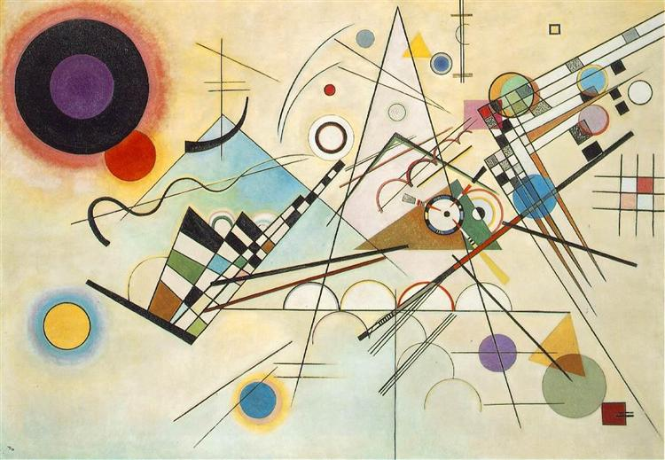
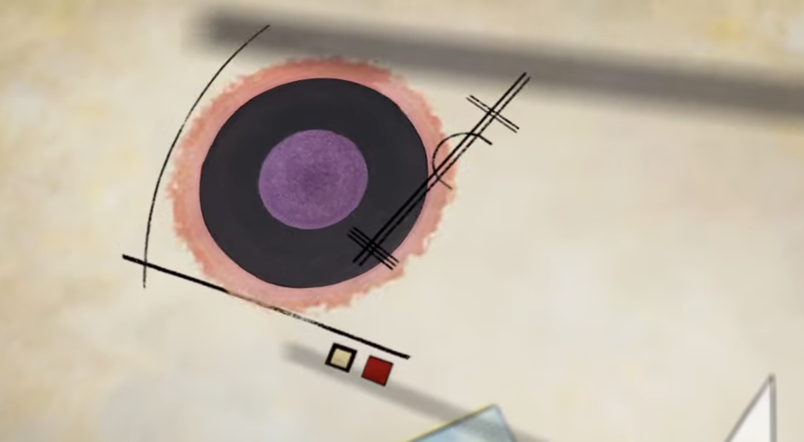
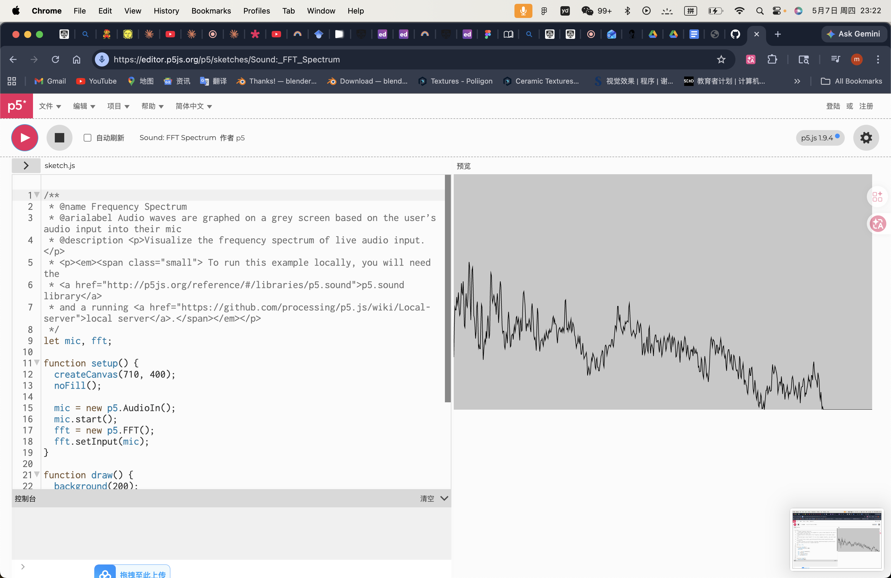

# meli0947_9103_TutSom

> Week 8 Quiz - Design Research

Final project direction: an interactive reinterpretation of Wassily Kandinsky's *Composition VIII* (1923).
My assigned mechanic: **Audio** - using the level or frequency content of an audio track to drive the visual.

---

## Part 1 - Imaging Technique Inspiration

### Source Example

The imaging technique I chose comes from a **painting**:

***Composition VIII*** by **Wassily Kandinsky** (1923).

- **Artist**: Wassily Kandinsky (1866 - 1944)
- **Year**: 1923
- **Medium**: Oil on canvas, 140 x 201 cm
- **Collection**: Solomon R. Guggenheim Museum, New York

This painting is the imaging source. The short animation ***The Kandinsky Effect*** by Manu Meyre (2010) is a **secondary reference** that helps me see how the painting's geometric vocabulary can be brought to life - I include it to illustrate the kind of dynamic reinterpretation I am aiming for, but the painting itself is what I am responding to.

- Reference animation: [The Kandinsky Effect on YouTube](https://www.youtube.com/watch?v=aMiiKLyIR88)

### Reference Images

**Image 1 - the original painting *Composition VIII* (1923):**

> *Source: Wikiart. The painting is built from circles, triangles, grids and curving lines arranged across a soft beige field.*

**Image 2 - a still from Manu Meyre's animation, showing how the same shapes can be reactivated as moving elements:**

> *Source: YouTube. This still is included as supporting evidence of the kind of dynamic reading I want to apply to Kandinsky's original composition.*

### Discussion

The aspect of *Composition VIII* I want to incorporate is its **geometric vocabulary as a visual score**:

- Big circles read as low, sustained tones.
- Sharp triangles read as high, percussive accents.
- Long lines and grids read as rhythmic structure.

Kandinsky himself argued that **shape and colour correspond to musical notes**, so the painting is already designed as if it were silent music. Treating each shape as an audio-driven element is a faithful extension of his own theory, not a decoration of it. This is highly beneficial for the assignment because it gives every shape a clean role for my **audio mechanic** to drive, supports modular code separation, and turns a static masterpiece into a live performance.

---

## Part 2 - Coding Technique Exploration

### Selected Technique

The coding technique I chose is **`p5.FFT`** - the Fast Fourier Transform class built into the p5.sound library.

It splits any audio stream (a music file or microphone input) into frequency band energies in real time. Two core methods:

1. `fft.getEnergy("bass")`, `fft.getEnergy("treble")` and so on - returns one 0 to 255 energy value for one frequency band.
2. `fft.analyze()` - returns a full 1024-bin spectrum array.

### Reference Image

**Screenshot - `p5.FFT` driving a real-time spectrum visualization:**
 

 
> *Source: screenshot from the p5.js official **Sound: FFT Spectrum** example sketch. Each vertical bar's height represents the energy of one frequency bin returned by* `fft.analyze()`*.*
 

### Discussion

`p5.FFT` directly supports the mapping I described in Part 1:

- `fft.getEnergy("bass")` makes the **main circle's radius breathe** with the low frequencies, matching Kandinsky's "deep tone" circles.
- `fft.getEnergy("treble")` makes **sharp triangles flicker** on high-frequency hits, matching his "percussive" reading of triangles.
- `fft.analyze()` returns the full spectrum so **each line's thickness can map to one band**, turning Kandinsky's grid into a rhythmic equalizer.

This contributes three things to the assignment: it directly satisfies the **audio mechanic** requirement, it makes **modular code separation natural** (one band per shape per file), and `loadSound()` lets users swap tracks for replay value.

### Example Implementation Links
 
**Primary reference - p5.js official "Sound: FFT Spectrum" example:**
 
- Runnable example sketch with full source code: [editor.p5js.org/p5/sketches/Sound:_FFT_Spectrum](https://editor.p5js.org/p5/sketches/Sound:_FFT_Spectrum)
**Tutorial video - Daniel Shiffman / The Coding Train, "17.11: Sound Visualization - Frequency Analysis with FFT":**
 
- Video walkthrough: [youtube.com/watch?v=2O3nm0Nvbi4](https://www.youtube.com/watch?v=2O3nm0Nvbi4)
**Documentation:**
 
- Official `p5.FFT` reference page: [p5js.org/reference/p5.sound/p5.FFT/](https://p5js.org/reference/p5.sound/p5.FFT/)
> All code that drives the technique above already exists at the linked sketch. I have **not** written any code myself for this quiz; the link above is sufficient to inspect a complete, working implementation.
 